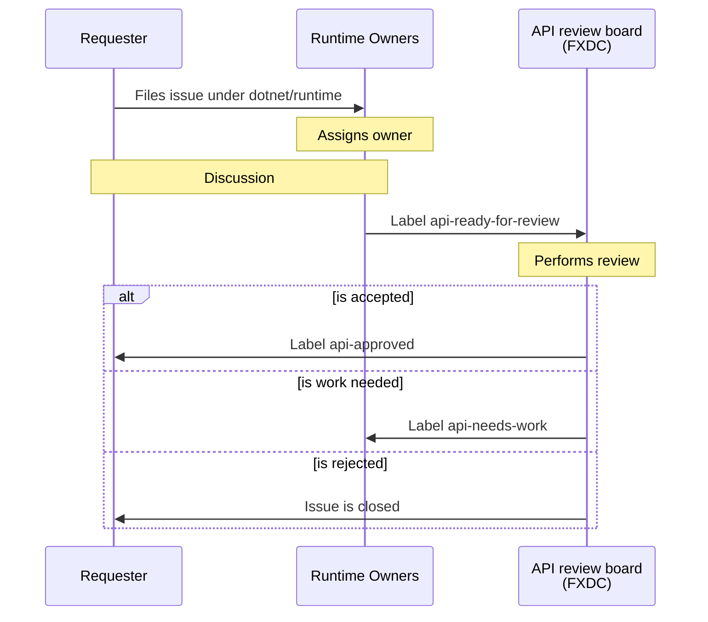

Notas sobre gestão ágil de projeto de software
==============================================

## Aplicar Scrum

Devemos usar Scrum como base para tudo que descrevemos aqui.

## Fluxos devem ser descritos

Todo fluxo deve ter uma documentação que o descreva, inclusive com gráficos.
Assim cada profissional pode focar no trabalho que o interessa.

> Exemplo de gráfico descrevendo um processo de iteração.

## Processo de desenvolvimento descrito

O processo de desenvolvimento como um todo deve estar descrito (em uma Wiki por exemplo) e acessível a todos
para que seja transparente todo o processo.

### Roadmap

Deve dar visibilidade ao _Roadmap_ como um documento (wiki) que descreve o planejamento geral da equipe, com
links interativos, imagens e links para itens de trabalho na ferramenta usada. Deve explicar como é feito
o planejamento, quais os valores considerados, a duração, etc. do próprio _roadmap_ além de exibi-lo.

No _roadmap_ também é um bom local para apresentar os _temas_ e iniciativas.
Mesmo que não use temas como itens de trabalho, eles devem ser exibidos no roadmap porque apontam onde
o foco deve ser depositado.

Não há necessidade de guardar histórico do roadmap, ex: roadmap-2021, roadmap-2022, etc., basta manter
"o roadmap" atualizado para que todos o usem como bússola para todo o trabalho atual sendo executado.

Por fim o _roadmap_ deve elencar todos os itens de trabalho a nível gerencial (temas, iniciativas e épicos)
e seu andamento. Aqui, a organização hierárquica ou com categorização é uma boa prática.

## Plano de iteração

O plano de iteração basicamente é um local que lista todas as iterações (sprints) planejadas, com links
para que se possa revisitar a cada uma.

Há um período, e em cada período temos o planejado e o executado de cada um dessas iterações.

Basicamente o planejado deve:
* Mostrar o objetivo da iteração (sprint)
* Mostrar os itens que entraram para o planejamento
* Guardar toda a discussão por meio de comentários pela equipe de tudo que foi planejado e decidido
* Datas de planejamento e motivos de mudanças

Também organizar os itens categorizados por épicos e recursos é uma ótima ideia, bem como cada
item deve apresentar sua situação atual.

O comprometimento (aceite) dos itens deve ser expresso pela equipe (pode ser só um ou mais líderes)
de forma explícita via comentário.

Basicamente o executado deve:
* Mostrar os itens concluídos em cada período
* Versões geradas, com links para artefatos e manuais
* Dados para notas de lançamento como itens, links para documentações, nomes de envolvidos, etc.

O executado deve apresentar os itens concluídos, notas sobre os não concluídos com seus motivos
e andamento atual.

Deve ser possível acompanhar um executado passado e ver uma foto do momento, e para isso não é
uma boa prática exibir status de itens dinamicamente, porque quando eles forem atualizados no
futuro pode afetar a visão passada.
